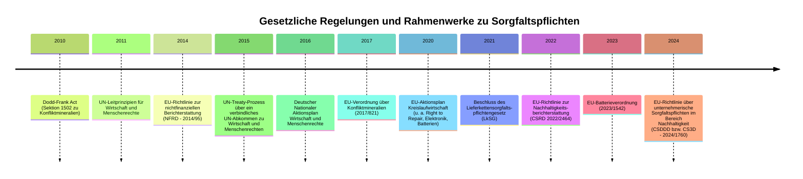

<!-- markdownlint-disable MD013 -->

# Nachhaltige Elektronik

## Sorgfaltspflichten

## Aktueller Zustand im Umfeld von Nachhaltigkeitsdaten

> "Für die Nachhaltigkeit relevanten Entscheidungen werden nicht zentral an einer Stelle getroffen, sondern in den Köpfen jeden Einzelnen, von Unternehmen bis hin zu Regierungen. Alle Menschen brauchen Zugang zu Daten die sie benötigen, um ihre eigenen Entscheidungen an Nachhaltigkeitszielen auszurichten."
>
> Sebastian Beschke

### Sustainable Data

- Verfügbarkeit und Nutzbarkeit (z.B. XML, PDF, etc.)
- Prioprietäre Tools
- Lizenzierte Datenbanken
- Non Disclosure Agreements (NDAs)

::: warning
-> Das hindert uns daran die Daten auf die Art und Weise zu nutzen, wie sie den größtmöglichen öffentlichen Nutzen erzeugen. Es führt dazu, dass diese Daten letztendlich nur für diejenigen verfügbar sind, die auch die dafür passenden Strukturen haben, um mit den Daten zu arbeiten. Auch ist eine gewisse Expertise und Finanzierung notwendig, um z.B. Lizenzen für Datenbanken zu erwerben.
:::

### Open Sustainable Data

::: success
-> Es werden die richtigen Tools und Ressourcen benötigt, um die Transformation durchzuführen.
:::

## Stichworte

- Full Material Declaration (FMD)
- Sustainability Data

## Initiativen

- [FairLötet e.V.](https://fairloetet.de/)
- [Responsible Minerals Initiative](https://www.responsiblemineralsinitiative.org/)
- [Fairtronics](https://fairtronics.org/)
- [Fairtrade](https://www.fairtrade.net/)
- [Initiative for Responsisble Mining Assurance](https://responsiblemining.net/)
- [Fairmined](https://fairmined.org/)
- [Blauer Engel](https://www.blauer-engel.de/)
- [Nager IT](https://www.nager-it.de/)
- [Fair IT yourself e.V.](https://fairityourself.de/)
- [Iniative Lieferkettengesetz](https://lieferkettengesetz.de/)
- [Deutscher Nachhaltigkeitskodex](https://www.deutscher-nachhaltigkeitskodex.de/)

## Talks auf media.ccc.de







