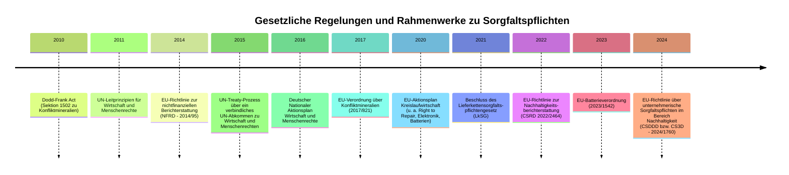

<!-- markdownlint-disable MD013 MD035 -->

<!-- .slide: data-background-image="https://hackmd.io/_uploads/Sk4Tav9WZe.png" data-background-opacity="0.4"-->
# Nachhaltige Elektronik

Leandro Ebner

---

## Inhaltsverzeichnis

1. TOC
2. TOC
3. TOC
4. TOC
5. TOC

---

<!-- .slide: data-background-color="white" -->
## Sorgfaltspflichten

###### 2025 by Leandro Ebner CC BY-SA 4.0

----

### Aktueller Zustand

> "Für die Nachhaltigkeit relevanten Entscheidungen werden nicht zentral an einer Stelle getroffen, sondern in den Köpfen des Einzelnen, von Unternehmen bis hin zu Regierungen. Alle Menschen brauchen Zugang zu Daten um ihre eigenen Entscheidungen an Nachhaltigkeitszielen auszurichten."
>
> \~ Sebastian Beschke

----

<!-- .slide: data-background-color="maroon" -->
### Sustainable Data

- Verfügbarkeit und Nutzbarkeit (XML, PDF, etc.) <!-- .element: class="fragment fade-in-then-semi-out" -->
- Prioprietäre Tools <!-- .element: class="fragment fade-in-then-semi-out" -->
- Lizenzierte Datenbanken <!-- .element: class="fragment fade-in-then-semi-out" -->
- Non Disclosure Agreements (NDAs) <!-- .element: class="fragment fade-in-then-semi-out" -->

----

<!-- .slide: data-background-color="seagreen" -->
### Open Sustainable Data

---
